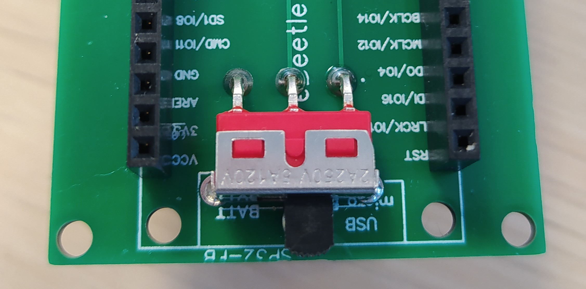
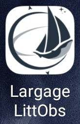
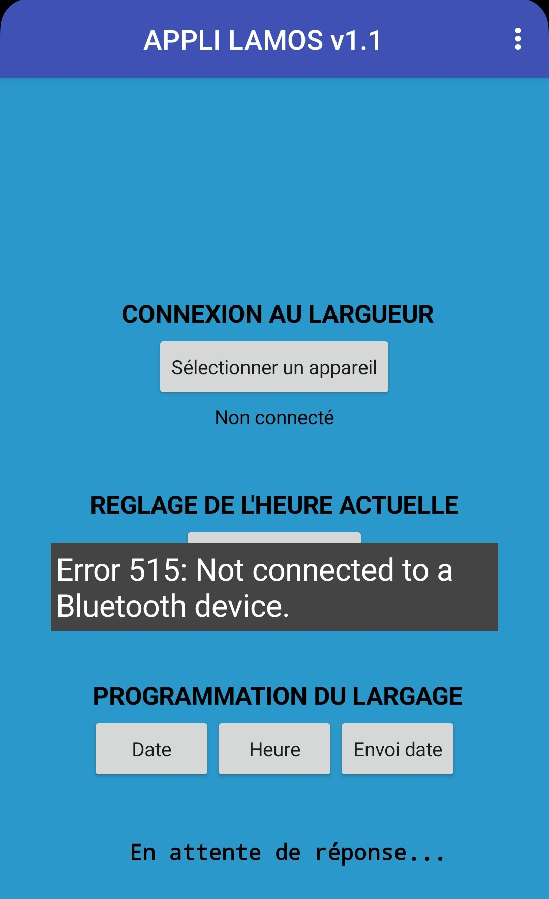

# Module 2 : Programmation PCB

## Matériel&#x20;

* Carte microcontrôleur ESP32 FireBeetle DFR0478
* Câble micro USB
* Ordinateur avec le logiciel Arduino
* Smartphone pour installer l'application

## Programmation Arduino du microcontrôleur

1. Ouvrir le programme Arduino "Lamos\_03\_mars\_v1-2\_bielle.ino" (Disponible sur [Github : software/firmware/Largueur\_temporel](https://github.com/astrolabe-expeditions/LittObs_OSOLAMOS/tree/main/software/firmware/Largueur_temporel))
2. Installer les librairies présentes en en-tête du programme :&#x20;

<figure><figcaption></figcaption></figure>

3. A la ligne 60 du programme, renommer le numéro de LAMOS par le vôtre

<figure><figcaption></figcaption></figure>

4. Dans le "Boards Manager" choisir le type de périphérique "FireBeetle-ESP32"&#x20;
5. Brancher le microcontrôleur sur un des ports USB de l'ordinateur et choisir le port série COM sur lequel est branché l'ESP32 (ex : "COM4")
6. Téléverser le programme vers le microcontrôleur à l'aide du bouton "upload"

<figure><figcaption></figcaption></figure>

6. Une fois le programme correctement téléversé, débrancher le microcontrôleur et le repositionner sur la carte électronique

## Installation de l'application pour le largage

1. Copier le fichier "Application\_LAMOS.apk" (disponible sur [Github : software/mobile](https://github.com/astrolabe-expeditions/LittObs_OSOLAMOS/tree/main/software/mobile)) sur un smartphone puis cliquer dessus pour l'installer&#x20;
2. Alimenter le microcontrôleur sur lequel a été téléversé le programme Arduino via la carte électronique en switchant l'interrupteur vers la droite

<figure><figcaption></figcaption></figure>

3. Dans les paramètres Bluetooth du smartphone, appairer avec le microcontrôleur que vous avez nommé précédemment (ex : ESP32\_LAMOS\_08)
4. Ouvrir l'application "largage LittObs"

<figure><figcaption></figcaption></figure>

5. Sur le premier onglet "Sélectionner un appareil", cliquer sur l'ESP32 appairé à l'étape précédente

<figure><figcaption></figcaption></figure>

6. Cliquer 2 fois sur "Send current time" pour mettre à l'heure l'horloge RTC de la carte électronique

<figure><figcaption></figcaption></figure>

7. Les 3 boutons du bas permettent de programmer le réveil de l'ESP32 et la commande du largage du LAMOS à la date souhaitée. Cette étape sera donc être réalisée juste avant la mise à l'eau du mouillage mais peut dors et déjà être testée
