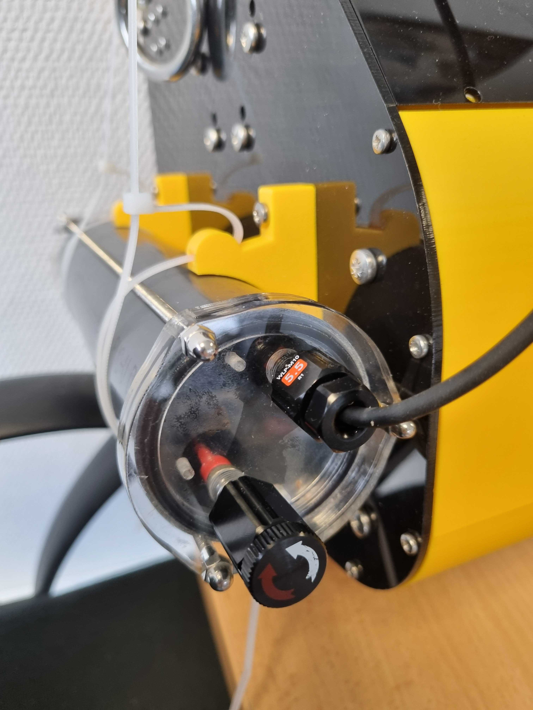

# Module 3 : Caisson moteur LAMOS

## Matériel

<table><thead><tr><th width="108.33331298828125">Quantité</th><th>Matériel</th></tr></thead><tbody><tr><td>0,25</td><td><a href="https://connexion-pression.com/tubes-rigides-pvc-pression/63-915-tube-d-63-pn16-pvc-pression.html#/13-taille_de_la_decoupe-decoupe_1_metre">Tube PVC PN16, Ø ext. 63mm, épais. 4,7mm (découpe d'un mètre)</a></td></tr><tr><td>0,25</td><td><a href="https://plaqueplastique.fr/product/plaque-plexiglass-xt-10mm-transparent/">Plaque plexiglass épais. 10mm transparent, L. 50cm x H. 30cm</a></td></tr><tr><td>3</td><td><a href="https://www.vis-express.fr/ecrou-borgne-inox-a4-din-1587-vs0100/37773-2559648-ecrou-borgne-m4-inox-a4.html#/267-conditionnement-200_pieces">Écrou borgne M4, inox A4 316</a></td></tr><tr><td>3</td><td><a href="https://fr.rs-online.com/web/p/ecrous-a-oreilles/2484315?gb=s">Écrou à oreilles M4, inox A4 316</a></td></tr><tr><td>1</td><td><a href="https://www.vis-express.fr/tige-filetee-longueur-1-metre-inox-a4-din-975vs3347vs0104/21608-tige-filetee-m4-longueur-1-metre-inox-a4.html">Tige filetée M4 x L. 1m, inox A4 316</a></td></tr><tr><td>4</td><td><a href="https://fr.rs-online.com/web/p/serre-cables/0233487?gb=a%20ou%20https://www.vis-express.fr/colliers-de-serrage-couleur-nylon/392369-2500286-collier-de-serrage-marron-48x290-nylon.html#/266-conditionnement-100_pieces">Colliers de serrage nylon 4,8mm x 300mm</a></td></tr><tr><td>1</td><td><a href="https://eu.store.bambulab.com/fr/products/petg-hf?id=49068714754396">Filament 3D PETG 1kg noir 1,75 mm</a></td></tr><tr><td>2</td><td><a href="http://fr.rs-online.com/web/p/joints-et-joints-toriques/1965129">Joint torique, Ø int. 52mm, Ø ext. 60mm, épais. 4mm</a></td></tr><tr><td>0,1</td><td><a href="https://fr.rs-online.com/web/p/graisses/0494124">Graisse silicone pour joints toriques</a></td></tr><tr><td>1</td><td><a href="http://syera.fr/boutique/gb/diametre-37-48-mm/195-penetrateur-wetlink-m10-4p5mm-lc.html">Pénétrateur WETLINK M10 4.5mm LC</a></td></tr><tr><td>1</td><td><a href="http://syera.fr/boutique/gb/accessoires/273-interrupteur-etanche-m10-5a.html">Interrupteur étanche M10 5A (SWITCH-M10-5A-R1)</a></td></tr></tbody></table>

## Outils :&#x20;

* Imprimante 3D
* Découpeuse laser
* Scie à métaux
* Tarauds
  &#x20;M3 et M10
* Tournevis
  &#x20;cruciformes
* Pince
  &#x20;plate ou multiprise
* Pistolet à colle
* Clé plate 7 et 8 mm
* Fer à souder&#x20;
* Perceuse + foret de 2,5 mm
* Fraise à chanfreiner à 45° avec roulement
* Graisse

## Pièces :&#x20;

<figure><figcaption></figcaption></figure>

19 - Tube PVC

20 - Tiges filetées

21 - Presse étoupe ou pénétrateur Wetlink

22 - Interrupteur étanche

23 - 24 - 25 - 26 - Éléments plexiglas découpés au laser pour les bouchons du tube

27- Joint torique

28 - 29 - Supports imprimés en 3D pour assembler les bouchons

30 - Carte électronique&#x20;

31 - Protection presse étoupe et interrupteur imprimé en 3D

32 - Écrous borgnes

33 - Écrous papillon

## **Étape 1 : Impression 3D**&#x20;

À l'aide d'une imprimante 3D, de filament PLA ou PETG et des fichiers ci-dessous, imprimez les pièces 28 et 29 à 15% de remplissage.&#x20;

* [PCB\_Support.stl](https://github.com/astrolabe-expeditions/LittObs_OSOLAMOS/tree/5120c5b76e9a005e6e9b74700a093cbc68596c3f/hardware/enclosures/box_elec)
* [PCB\_Holder.stl](https://github.com/astrolabe-expeditions/LittObs_OSOLAMOS/tree/5120c5b76e9a005e6e9b74700a093cbc68596c3f/hardware/enclosures/box_elec)

Imprimer également la pièce 31 avec un remplissage plus élevé (>30%) pour plus de résistance car elle sera soumise à plus d'efforts mécaniques.

* [Sensor\_protection.stl](https://github.com/astrolabe-expeditions/LittObs_OSOLAMOS/tree/5120c5b76e9a005e6e9b74700a093cbc68596c3f/hardware/enclosures/box_elec)

## **Étape 2 : Découpe laser**&#x20;

À l'aide d'une découpeuse laser et des fichiers ci-dessous, découpez les pièces 23, 24, 25 et 26 sur une plaque de plexiglas de 10mm.&#x20;

* [PMMA\_Caps\_LAMOS.svg](https://github.com/astrolabe-expeditions/LittObs_OSOLAMOS/tree/5120c5b76e9a005e6e9b74700a093cbc68596c3f/hardware/enclosures/box_elec)

## **Étape 3 : Perçage et taraudage des bouchons**

* À l'aide d'un taraud M3, taraudez les 4 trous extérieurs de la pièce 24. Faites de même pour les 2 plus trous trous avec un taraud M10 (qui viendront accueillir l'interrupteur étanche et le presse étoupe).
* A l'aide d'un forêt 2.5mm, percez 2 trous dans la pièce 25 à l'emplacement des 2 croix gravées par la découpeuse laser. Ces trous ne doivent pas être traversants et sont d'une profondeur d'au moins 5 mm (idéalement un plus plus que la moitié de l'épaisseur totale du plexiglas).\
  À l'aide d'un taraud M3, taraudez les 2 trous venant d'être percés dans la pièce 25.
* Aucun taraudage n'est nécessaire pour les pièces 23 et 26

<figure><figcaption></figcaption></figure> <figure><figcaption></figcaption></figure>

## **Étape 4 : Assemblage des bouchons**

Pour assembler le bouchon avant, superposez la pièce 24 sur la pièce 23 en alignant bien les trous centraux et placez un joint torique (27.a) à la jonction entre les deux pièces.

<figure><figcaption></figcaption></figure> <figure><figcaption></figcaption></figure>

Vissez ensuite l’interrupteur (22) et le pénétrateur WETLINK (21) au niveau des trous de la pièce 23 (paroi extérieure du bouchon) :&#x20;

<figure><figcaption></figcaption></figure>

A l'aide de petites vis M3 de 10mm, vissez le gros support précédemment imprimé (29) à la paroi arrière du bouchon (24)&#x20;

<figure><figcaption></figcaption></figure> <figure><figcaption></figcaption></figure>

Assemblez maintenant le second bouchon à l'aide des pièces 25, 26, 27.b et 28 et de 2 vis M3 de 15mm.&#x20;

<figure><figcaption></figcaption></figure> <figure><figcaption></figcaption></figure>

Caler et visser la carte électronique à la grande cale (29) à l’aide de 2 petites vis M3 et éventuellement de 2 écrous.

<figure><figcaption></figcaption></figure>

## **Étape 5 : Découpe et chanfrein du tube**

Dans un tube en PVC PN16 de 63mm de diamètre, découpez une portion de 25cm et chanfreiner les deux extrémités intérieures du tube à l'aide d'une fraise à chanfreiner à 45° avec roulement. Le tranchant de la fraise doit ressortir d'environ 4-5 mm de telle sorte à ce que le chanfrein soit suffisant sans pour autant venir complètement manger le bord extérieur.

<figure><figcaption></figcaption></figure> <figure><figcaption></figcaption></figure>

## **Étape 6 : Assemblage du tube**

Placer les deux supports de fixation de sonde sur le tube.

Visser des écrous borgnes M4 à une des extrémités de chacune des 3 tiges filetés (20).

Glisser la pièce 31 (protection de capteurs) par l'autre extrémité des tiges filetés et faites la glisser jusqu'aux écrous borgnes.&#x20;

<figure><figcaption></figcaption></figure>

Faites glisser l'assemblage bouchon avant + carte électronique dans les tiges filetés.&#x20;

Faites glisser le tube et les supports de fixation le long des tiges filetés.&#x20;

Emboiter le bouchon arrière (25, 26, 27.b et 28) à l'extrémité du tube et sur les tiges filetés.

Bloquer le tout en vissant les 3 écrous papillon
