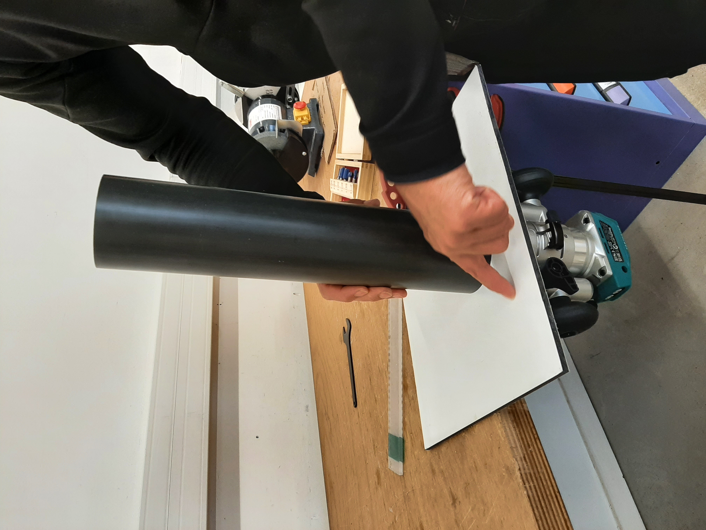

# Module 3 : Caisson moteur LAMOS

## Matériel

<table><thead><tr><th width="108.33331298828125">Quantité</th><th>Matériel</th></tr></thead><tbody><tr><td>0,25</td><td><a href="https://connexion-pression.com/tubes-rigides-pvc-pression/63-915-tube-d-63-pn16-pvc-pression.html#/13-taille_de_la_decoupe-decoupe_1_metre">Tube PVC PN16, Ø ext. 63mm, épais. 4,7mm (découpe d'un mètre)</a></td></tr><tr><td>0,25</td><td><a href="https://plaqueplastique.fr/product/plaque-plexiglass-xt-10mm-transparent/">Plaque plexiglass épais. 10mm transparent, L. 50cm x H. 30cm</a></td></tr><tr><td>3</td><td><a href="https://www.vis-express.fr/ecrou-borgne-inox-a4-din-1587-vs0100/37773-2559648-ecrou-borgne-m4-inox-a4.html#/267-conditionnement-200_pieces">Écrou borgne M4, inox A4 316</a></td></tr><tr><td>3</td><td><a href="https://fr.rs-online.com/web/p/ecrous-a-oreilles/2484315?gb=s">Écrou à oreilles M4, inox A4 316</a></td></tr><tr><td>1</td><td><a href="https://www.vis-express.fr/tige-filetee-longueur-1-metre-inox-a4-din-975vs3347vs0104/21608-tige-filetee-m4-longueur-1-metre-inox-a4.html">Tige filetée M4 x L. 1m, inox A4 316</a></td></tr><tr><td>4</td><td><a href="https://fr.rs-online.com/web/p/serre-cables/0233487?gb=a%20ou%20https://www.vis-express.fr/colliers-de-serrage-couleur-nylon/392369-2500286-collier-de-serrage-marron-48x290-nylon.html#/266-conditionnement-100_pieces">Colliers de serrage nylon 4,8mm x 300mm</a></td></tr><tr><td>1</td><td><a href="https://eu.store.bambulab.com/fr/products/petg-hf?id=49068714754396">Filament 3D PETG 1kg noir 1,75 mm</a></td></tr><tr><td>2</td><td><a href="http://fr.rs-online.com/web/p/joints-et-joints-toriques/1965129">Joint torique, Ø int. 52mm, Ø ext. 60mm, épais. 4mm</a></td></tr><tr><td>0,1</td><td><a href="https://fr.rs-online.com/web/p/graisses/0494124">Graisse silicone pour joints toriques</a></td></tr><tr><td>1</td><td><a href="http://syera.fr/boutique/gb/diametre-37-48-mm/195-penetrateur-wetlink-m10-4p5mm-lc.html">Pénétrateur WETLINK M10 4.5mm LC</a></td></tr><tr><td>1</td><td><a href="http://syera.fr/boutique/gb/accessoires/273-interrupteur-etanche-m10-5a.html">Interrupteur étanche M10 5A (SWITCH-M10-5A-R1)</a></td></tr></tbody></table>

## Outils :&#x20;

* Imprimante 3D
* Découpeuse laser
* Scie à métaux
* Taurauds
* Tournevis
* Pince
* Pistolet à colle
* Clé plate 7mm
* Fer à souder&#x20;
* Perceuse + foret de 2,5
* <mark style="background-color:$danger;">Fraise à chanfreiner à 45° avec roulement.</mark>

## Pièces :&#x20;

<figure><figcaption></figcaption></figure>

## **Étape 1 : Impression 3D**&#x20;

À l'aide d'une imprimante 3D, de filaments en PETG et des fichiers ci-dessous, imprimer les pièces 21, 28 et 29 à 15% de remplissage.

## **Étape 2 : Découpe laser**&#x20;

À l'aide d'une découpeuse laser et des fichiers ci-dessous, découpez les pièces 23, 24, 25 et 26 dans des plaques de plexiglass de 10mm.&#x20;

## **Étape 3 : Taraudage des bouchons**

A l'aide d'un taraud M10, tarauder les pièces 23 et 24.

Placez la pièce 26 au centre de la pièce 25 puis, a l'aide d'une perceuse et d'un foret M2,5, percez des trous dans la pièce 25 aux mêmes emplacements que ceux de la pièce 26.

A l'aide d'un taraud M3, tarauder les pièces 25 et 26.

<figure><figcaption></figcaption></figure> <figure><figcaption></figcaption></figure>

## **Étape 4 : Assemblage des bouchons**

Pour assembler le bouchon avant, superposé la pièce 24 sur la pièce 23 en alignant bien les trous centraux puis placez un joint taurique (27.a) à la jonction entre les deux pièces.

<figure><figcaption></figcaption></figure> <figure><figcaption></figcaption></figure>

Visser ensuite l’interrupteur (22) et le <mark style="color:$warning;background-color:$danger;">??</mark> dans les trous de la pièce 23 (paroi extérieure du bouchon):&#x20;

<figure><figcaption></figcaption></figure>

Visser la grande calle (29) à la pièce 24 (paroi arrière du bouchon) à l’aide de 4 petites visses M3 de 20mm.&#x20;

<figure><figcaption></figcaption></figure> <figure><figcaption></figcaption></figure>

Assembler maintenant le second bouchon à l'aides des pièces 25, 26, 27.b et 28 et de 2 petites visses M3.&#x20;

<figure><figcaption></figcaption></figure> <figure><figcaption></figcaption></figure>

Callez et vissez la carte électronique à la grande calle (29) à l’aide de 2 petites visses en nylon <mark style="color:$warning;background-color:$danger;">type M?</mark>

<figure><figcaption></figcaption></figure>

## **Étape 5 : Découpe et chanfreinage du tube**

Dans un tube en PVC PN16 de 63mm de diamètre, découpez un portion de 25cm et chanfreinez les deux extrémités intérieures du tube <mark style="background-color:$danger;">à l'aide d'une fraise à chanfreiner à 45° avec roulement.</mark>

<figure><figcaption></figcaption></figure> <figure><figcaption></figcaption></figure>

## **Étape 6 : Assemblage du tube**

Placez les deux calle-corde sur le tube.

Placez des écrous borgnes au bout des 3 tiges filetés (20).

Emboiter la pièce 31 par l'autre extrémité des tiges filetés et faites la glisser jusqu'aux écrous.&#x20;

<figure><figcaption></figcaption></figure>

Faites glisser l'assemblage bouchon avant + grande calle + PCB dans les tiges filetés.&#x20;

Faites glisser le tube et les calle-corde sur les tiges filetés.&#x20;

Placez le bouchon arrière (25, 26, 27.b et 28) à l'extrémité du tube et sur les tiges filetés.

Emboiter fermement le tout et bloquez avec des écrous à oreilles.
