# Module 6 : Pack batterie 12V 3S1P

### Prérequis

[Li-Ion Battery (18650)](https://www.notion.so/Li-Ion-Battery-18650-3ce9150c05694fa6800244b883904219?pvs=21)

### Objectif

Assembler en série 3 cellules 18650 (3.7v) afin d’obtenir une batterie 12v avec une carte de protection et de régulation de charge (BMS)

### Matériel nécessaire

<figure><figcaption></figcaption></figure>

* Soudeuse par points à pédale (ici “Seesii 8000W foot pedal spot welder”)
* Poste à souder à l’étain
* Multimètre
* Pince coupante et pince à dénuder
* Lunettes de protection
* Consommables :
  * 3 batteries Li-Ion 18650 (3.7v 3400mAh)
  * Carte de protection de batterie BMS 3S 20A 12.6v
  * Connecteur XT30 mâle
  * Fil électrique souple
  * Chatterton
  * Etain
  * Bande de Nickel 0.1x0.8mm
  * Gaine thermo rétractable PVC bleue pour batteries 18650 (largeur à plat 85mm)

### A faire préalablement

* Mettre en charge soudeuse par points (à utiliser non branchée)
* Mettre en charge les 3 cellules 18650 et contrôler leur état : [Li-Ion Battery (18650)](https://www.notion.so/Li-Ion-Battery-18650-3ce9150c05694fa6800244b883904219?pvs=21)

### Etapes de réalisation

* Disposer les 3 cellules tête bêche et les numéroter comme sur le schéma ci-dessous :

<figure>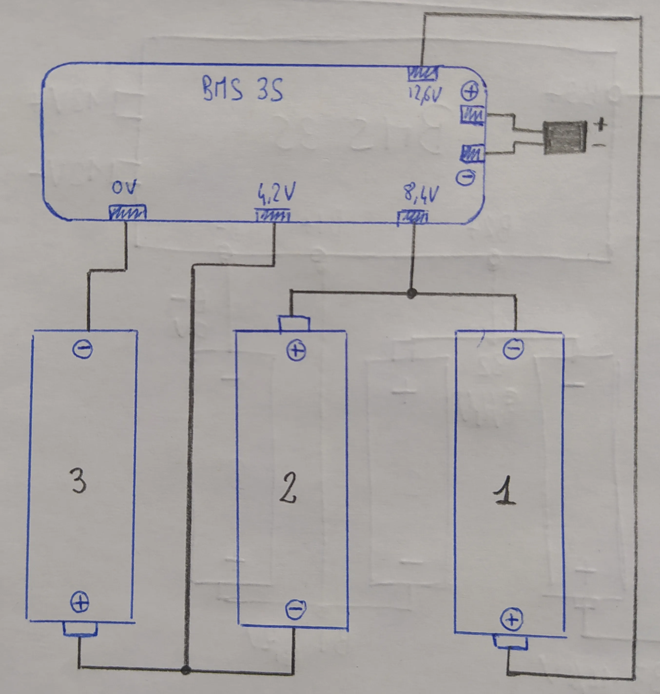<figcaption></figcaption></figure>

* Les maintenir entre elles avec du chatterton

<figure>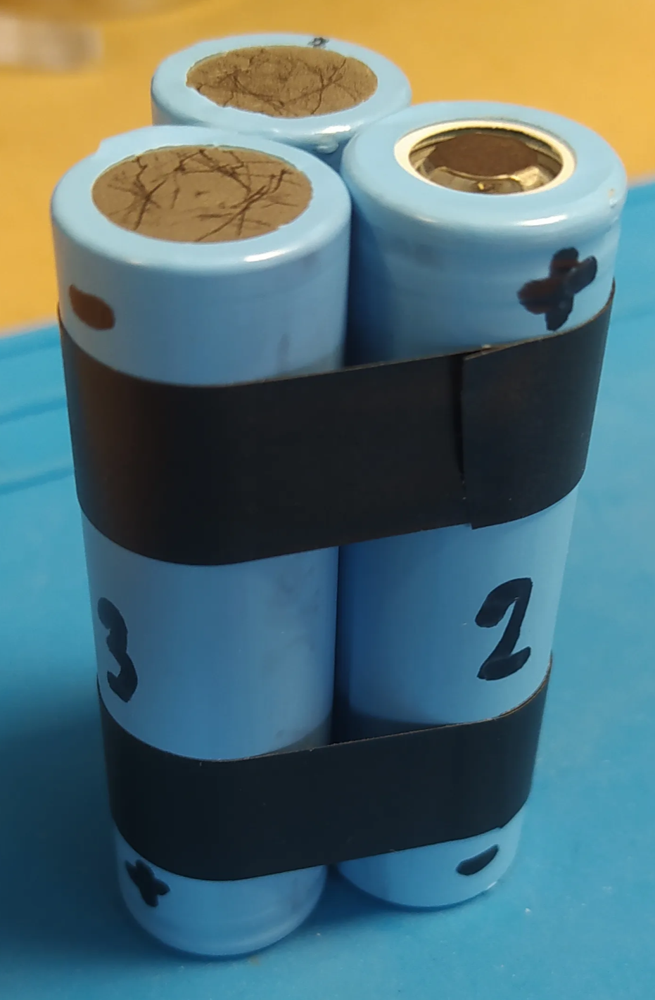<figcaption></figcaption></figure>

* Découper 2 bandes de nickel de 3 cm chacune
*   Débrancher la soudeuse par points et l’allumer en la réglant entre 50 et 60

    <figure>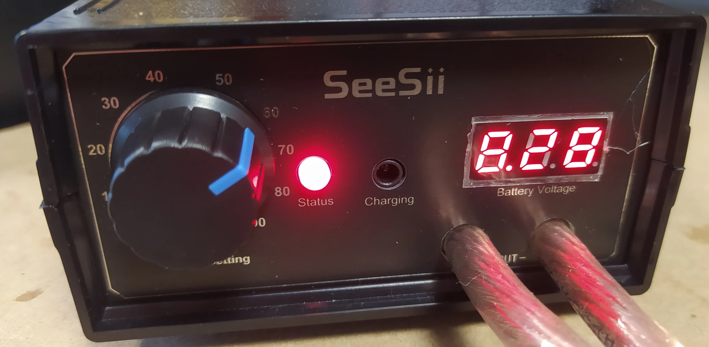<figcaption></figcaption></figure>
* **/!\ Penser à mettre des lunettes de protection**
*   Souder les 2 bandes prédécoupées (idéalement 4 points par cellule) afin de relier :

    * La borne + de la cellule 3 avec la borne - de la cellule 2 (Cf schéma plus haut)
    * La borne + de la cellule 2 avec la borne - de la cellule 1 (Cf schéma plus haut)

    <figure>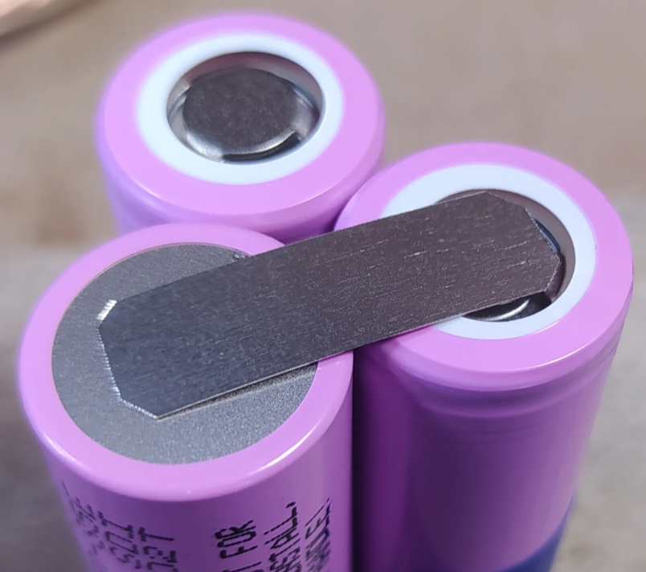<figcaption></figcaption></figure>

    <figure>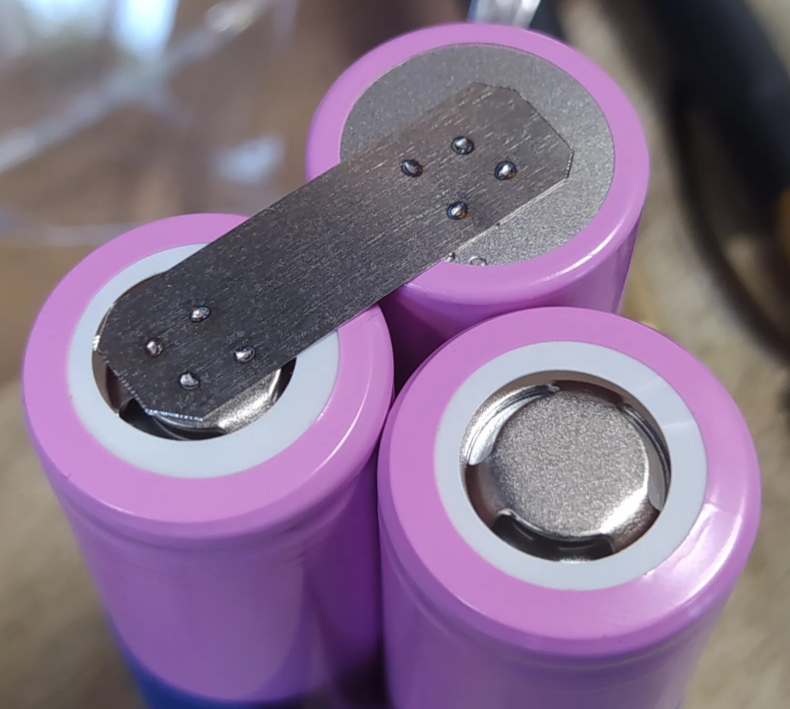<figcaption></figcaption></figure>

* Préparer 4 bandes de nickel de 3 cm chacune et les plier à angle droit
*   Relier ces bandes à la carte BMS par l’intermédiaire de fils électriques brasés à l’étain :

    * Sur pin “0V” du BMS : fil noir d’environ 1-2 cm
    * Sur pin “4.2V” du BMS : fil rouge d’environ 3 cm
    * Sur pin “8.4V” du BMS : fil rouge d’environ 6 cm
    * Sur pin “12.6V” du BMS : fil rouge d’environ 6 cm
    * Sur pins de sortie “+ -” : fils d’une 10aine de cm

    <figure>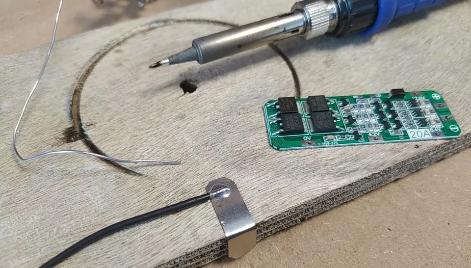<figcaption></figcaption></figure>

    <figure>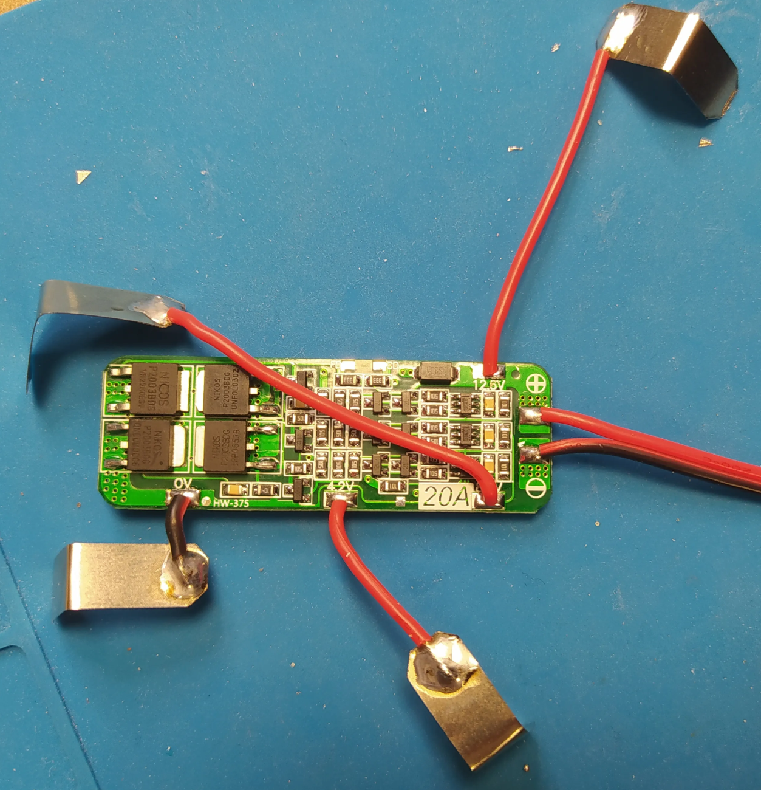<figcaption></figcaption></figure>

    <figure>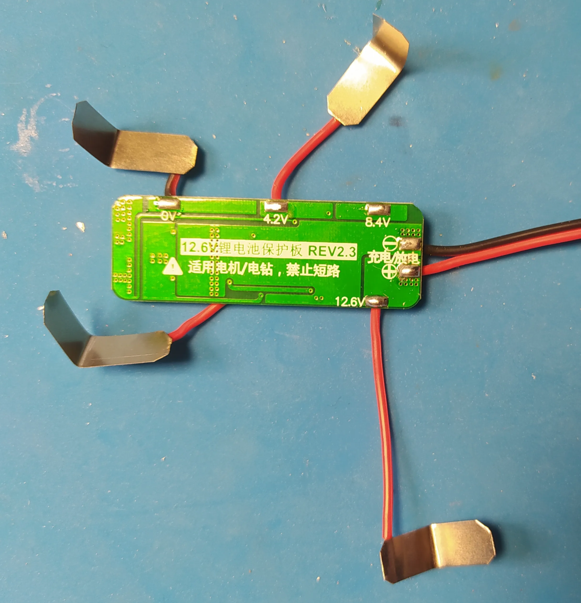<figcaption></figcaption></figure>

* Rallumer la soudeuse par points ( **/!\ Penser aux lunettes de protection** )
*   Souder chaque pate au bon potentiel des batteries :

    * Pin “4.2V” sur la borne + de la cellule 3
    * Pin “8.4V” sur la borne + de la cellule 2
    * Pin “12.6V” sur la borne + de la cellule 1
    * Pin “0V” sur la borne - de la cellule 3

    <figure>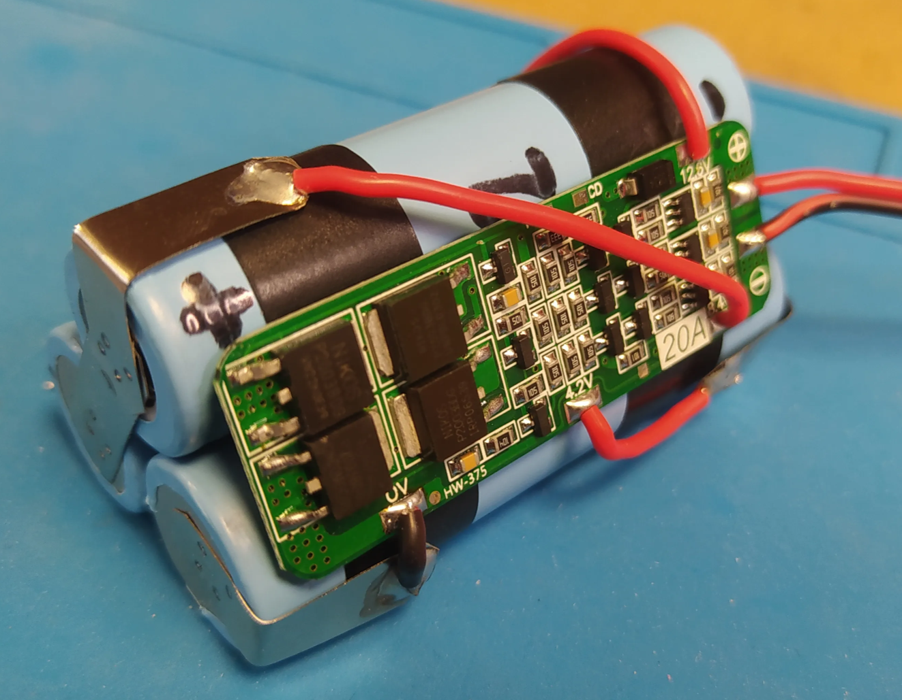<figcaption></figcaption></figure>

    <figure>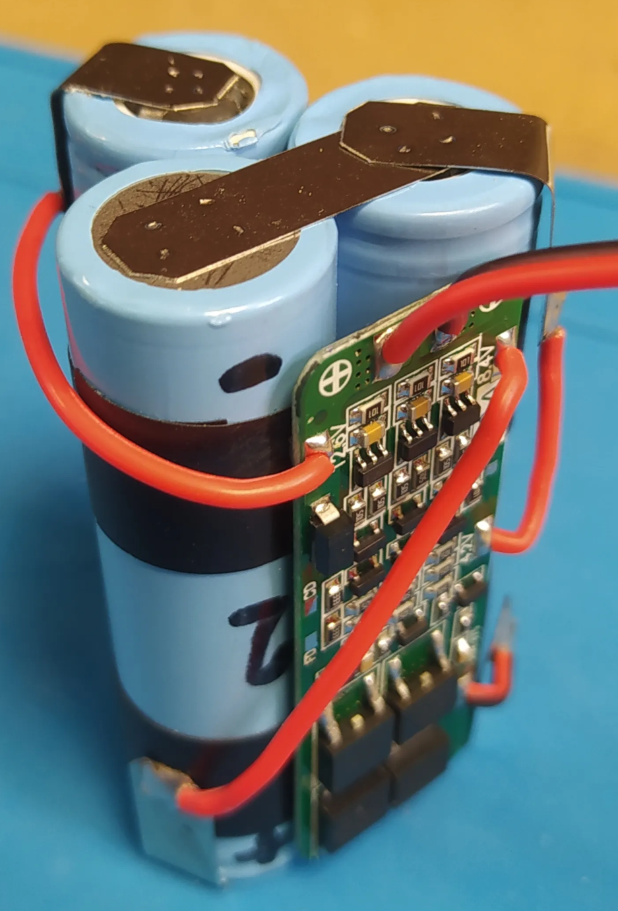<figcaption></figcaption></figure>

* A l’aide du multimètre, vérifier que la tension de sortie du BMS tourne bien autour des 12.6V
* Découper une bande de gaine thermo rétractable bleue d’environ 12 cm, y glisser le pack batterie et faire tranquillement rétracter la gaine à l’aide d’un pistolet à air chaud (réglé autour des 100°C)

<figure>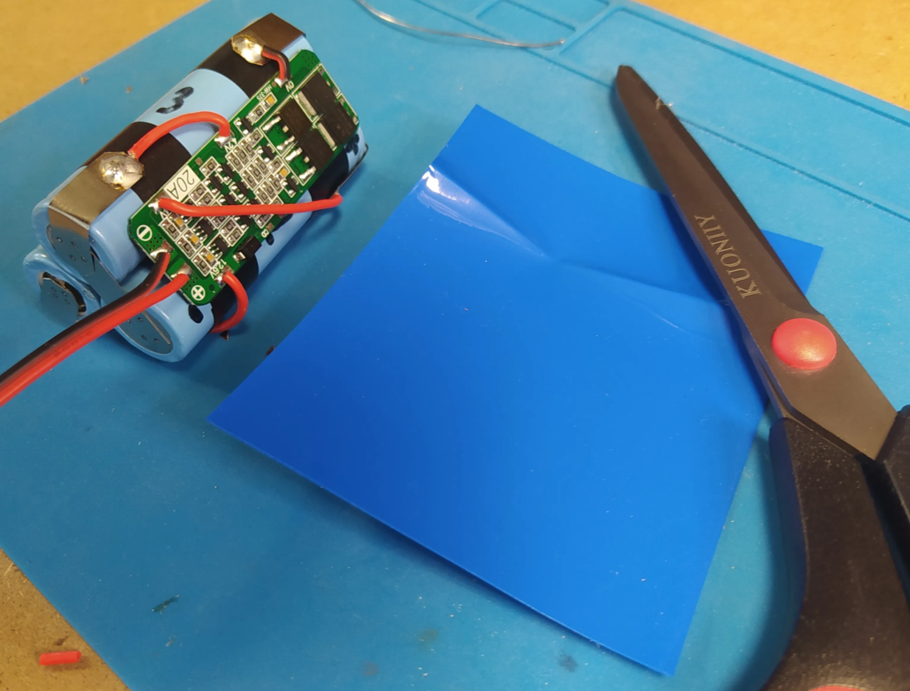<figcaption></figcaption></figure>

<figure>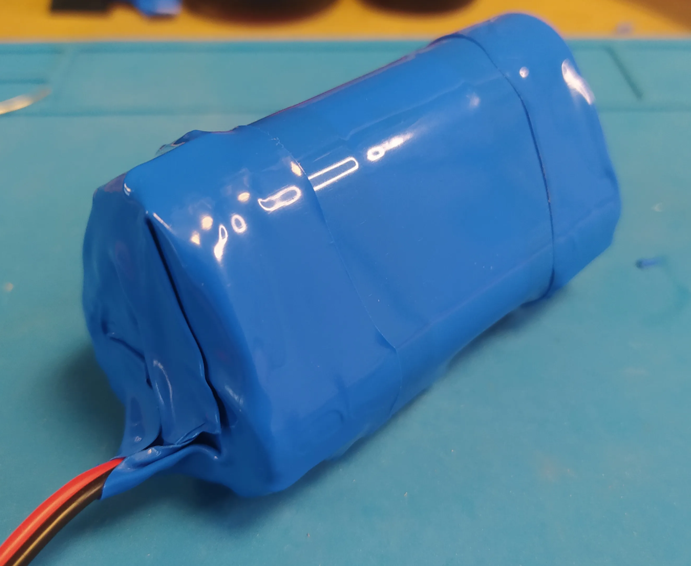<figcaption></figcaption></figure>

